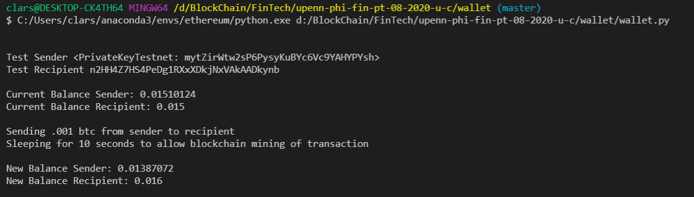
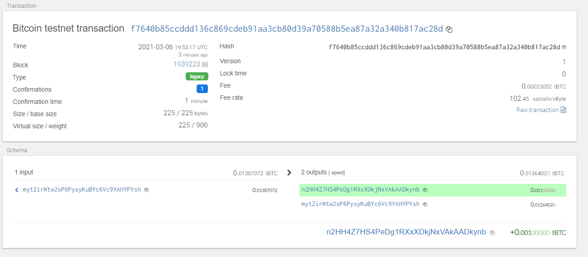
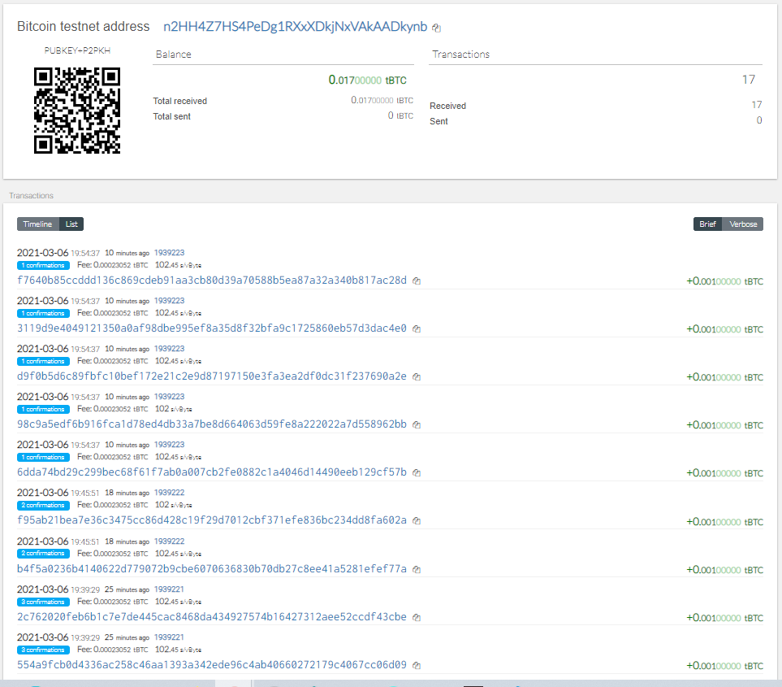

# Use HD Derive PHP wallet which support BIP32, BIP39, BIP44 and non-standard deviation paths to create a "universal" wallet. 

## Tools Used

* hd-walet-derive (PHP)
* bit - *Python Bitcoin Library*
* web3.py -  *Python Ethereum Library*
* Bitcoin Tesnet Block Explorer

## Proof of transactions

**Code output of last transation performed.**

>

**Transaction on Bitcoin Testnet Block Explorer**

>

**Multiple Transactions Because They Are Fun**

>

